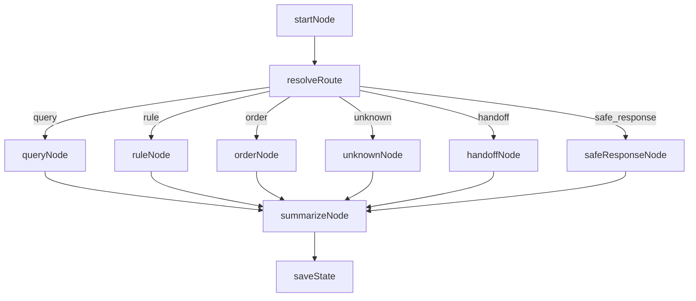

# Graph Status 设计说明

本文档描述当前 `GraphState` 编排中各类状态字段的定义、来源与流转语义（基于现有代码实现）。

## 1. 状态总览

系统目前有 4 组核心状态语义：

1. **路由状态（route）**：当前消息被分派到哪个 Agent
2. **结果状态（AgentResult.status）**：当前处理结果阶段
3. **订单工作流状态（OrderWorkflowState.step）**：订单流程细粒度阶段
4. **人工接管状态（HandoffState.status）**：是否处于人工接管

相关代码：
- `app/core/state.py`
- `app/core/orchestrator.py`
- `app/chains/order_chain.py`

---

## 2. route（路由状态）

字段位置：
- `AgentResult.route`
- 图中中间态 `GraphState.route`

当前值：
- `query`：查询类（SearchAgent）
- `rule`：规则类（RAGAgent）
- `order`：订单类（OrderAgent）
- `unknown`：无法识别，进入澄清分支
- `handoff`：图路由内部值，转人工节点（最终 `AgentResult.route` 当前实现仍返回 `unknown`）

说明：
- `route` 决定图节点走向，不等价于“流程是否完成”。

---

## 3. AgentResult.status（结果状态）

字段位置：
- `app/core/state.py -> AgentResult.status`

这是前端/接口最应关注的状态字段。当前实现中可能出现：

- `ok`：处理成功（查询成功、规则回答成功）
- `no_result`：执行成功但未查到数据
- `error`：执行失败（如 SQL 执行失败、RAG 异常）
- `clarify`：需要用户澄清意图
- `handoff`：已进入人工接管分支
- `safe_response`：图异常降级返回
- `collecting_info`：订单信息收集中
- `awaiting_pre_confirm`：订单执行前等待确认
- `executed_waiting_click`：订单执行完成，等待点击链接确认
- `closed`：订单流程已结束
- `failed`：订单流程失败

说明：
- `SummarizerAgent` 当前仅在 `status in {"ok", "closed"}` 时前缀“处理完成”。

---

## 4. OrderWorkflowState.step（订单工作流状态）

字段位置：
- `app/core/state.py -> OrderWorkflowState.step`
- `ChatMessageResponse.workflow_step` 由该字段透传

当前定义值（`OrderStatus`）：
- `collecting_info`
- `awaiting_pre_confirm`
- `executed_waiting_click`
- `closed`
- `failed`

说明：
- 这是“订单域状态”，与 `AgentResult.status` 有重叠但用途不同：
  - `AgentResult.status`：本轮响应语义
  - `workflow_step`：会话中的订单流程当前位置

---

## 5. HandoffState.status（人工接管状态）

字段位置：
- `app/core/state.py -> HandoffState.status`

当前值：
- `inactive`
- `active`

当前行为：
- 当 `handoff.enabled=true` 且配置 `HANDOFF_ENABLED=true` 时，图进入 `handoff_node`，返回 `status="handoff"`。

---

## 6. 当前状态流转（简化）

---

## 7. 接口层如何解释状态（建议）

前端可按优先级处理：

1. `status=error|safe_response`：显示失败提示
2. `status=clarify`：显示澄清引导
3. `status in {collecting_info, awaiting_pre_confirm, executed_waiting_click}`：展示订单步骤 UI
4. `status=handoff`：展示人工接管中
5. `status=no_result`：展示无数据提示
6. `status=ok|closed`：展示成功结果

---

## 8. 注意事项（当前实现）

- `workflow_step` 当前默认来自 `OrderWorkflowState.step`，即使在 query/rule 路径也可能看到默认值 `collecting_info`。
- `handoff` 在图路由层是一个 route 分支，但输出结果 route 当前实现为 `unknown`（如需前端精确识别，可后续改为 `route="handoff"`）。
