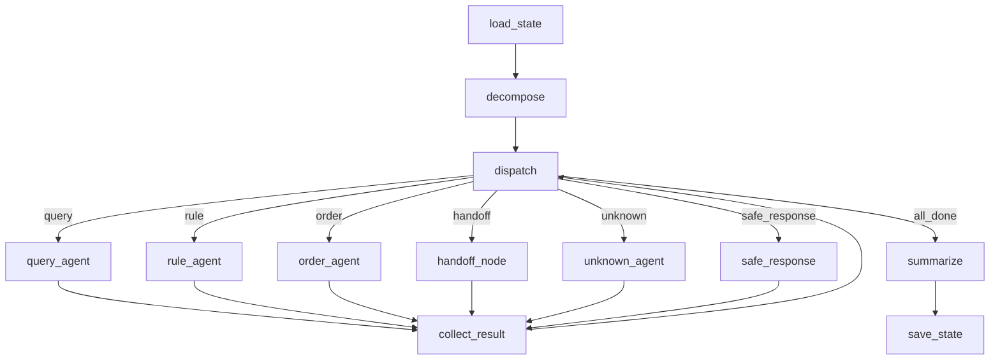

# Graph Status 设计说明（最新）

本文档描述当前 `GraphState` 编排中的状态结构、路由语义与关键流转，已同步近期重构与修复。

## 1. 状态总览

系统目前以 3 层 `GraphState` 为主：

1. **`session`**：跨轮次真源（当前仅 `conversation`）
2. **`runtime`**：单轮执行态（任务列表、当前索引、原始结果等）
3. **`trace`**：可观测轨迹（RAG/SQL/订单 records + observability）

相关代码：
- `app/core/state.py`
- `app/core/orchestrator.py`
- `app/core/session_store.py`

---

## 2. route（路由状态） 

字段位置：
- `runtime.route`（图中间态）
- `AgentResult.route`（对外结果）

当前主要值：
- `query`：查询类（`SearchAgent`）
- `rule`：规则类（`RAGTool`）
- `order`：订单类（`OrderAgent`）
- `handoff`：人工接管分支
- `unknown`：无法识别，进入澄清分支
- `safe_response`：异常降级分支
- `all_done`：图内收敛态（仅用于路由，不对外）

说明：
- `route` 决定节点走向，不代表最终业务完成状态。
- `session_meta` 分支已停用，入口统一走 `decompose`。

---

## 3. AgentResult.status（结果状态）

字段位置：
- `app/core/state.py -> AgentResult.status`

常见值：
- `ok`
- `no_result`
- `error`
- `clarify`
- `handoff`
- `safe_response`
- `collecting_info`
- `awaiting_pre_confirm`
- `closed`
- `failed`

说明：
- 这是前端/接口最应关注的状态字段。
- `runtime.raw` 为当前任务原始结果，`runtime.result` 为汇总后的最终结果。

---

## 4. 任务模型（Task 多态）

当前 `runtime.sub_tasks` 已由单一 `SubTask` 改为联合类型：
- `QueryTask`
- `RuleTask`
- `OrderTask`（独有 `order_operation_hint`）
- `HandoffTask`
- `UnknownTask`
- `SessionMetaTask`（类型仍保留，但编排已不走该节点）

说明：
- `depends_on` 用于串联前序任务依赖。
- `runtime.task_context[task_id]` 用于跨子任务共享输出（例如查询结果传给订单任务）。

---

## 5. 订单链路状态与追踪

### 5.1 订单会话真源
- `OrderContext` 由 `SessionStore` 独立持有，不再镜像到 `GraphState.session`。
- 订单流程阶段使用 `OrderStatus`：`collecting_info` / `awaiting_pre_confirm` / `closed` / `failed`。

### 5.2 订单轨迹（trace）
- `trace.order_trace.records: list[OrderTaskRecord]`
- 每条记录当前包含：
  - `task_id`
  - `operation`
  - `source_dep_task_ids`
  - `loaded_items_count`
  - `status`
  - `message`
  - `order_link`
  - `error`

### 5.3 近期修复（重要）
- 在 `_order_node` 中，订单任务会读取其 `depends_on` 对应任务的：
  - `runtime.task_context[dep_id].outputs.proposed_order_items`
- 读取成功后注入 `OrderContext.items`，用于“先查后下单”场景。
- 若声明了依赖但未提取到可下单商品，返回：
  - `status="collecting_info"`
  - `error="missing_dependency_items"`
  - 明确提示用户先确认商品列表。

---

## 6. 人工接管状态

- `HandoffState` 由 `SessionStore` 独立管理（不在 `GraphState.session` 内）。
- 当 `handoff.enabled=true` 且配置允许时，`dispatch` 会路由到 `handoff_node`。

---

## 7. 当前状态流转（简化）

---

## 8. 接口层解释建议

建议按优先级处理 `status`：

1. `error` / `safe_response`：展示失败与重试建议
2. `clarify`：展示澄清引导
3. `handoff`：展示人工处理中
4. `collecting_info` / `awaiting_pre_confirm`：展示订单流程 UI
5. `no_result`：展示无数据提示
6. `ok` / `closed`：展示成功结果

---

## 9. 注意事项

- `session_meta` 节点已停用：不再走“会话回顾短路”，统一进入意图拆解。
- `SessionMetaTask` 目前仅为兼容类型保留，路由器已将 `session_meta` 意图降级为 `unknown`。
- 订单“先查询再下单”依赖 `proposed_order_items` 输出约定；若上游未产出，订单节点会显式报 `missing_dependency_items`。
- 当存在活跃订单时，编排采用“严格订单主线”策略：
  - `decompose` 阶段直接构建单一 `OrderTask`，不再插入其它子任务
  - `dispatch` 阶段在活跃订单下统一路由 `order`
  - 只有订单进入 `closed/failed` 后，才恢复常规意图拆解与多任务执行
  - 当订单状态为 `collecting_info` 时，`collect_result` 会追加 `pending_actions[type=order_fill_fields]`：
    - 携带 `operation`、`required_fields`（含中文 label）与 `prefill`
    - 前端可据此弹出表单引导用户填写，而非依赖自由文本补字段
  - 已提供结构化提交接口：`POST /api/v1/orders/fill-fields`
    - 入参：`session_id`、`user_id`、`fields`
    - 出参：`status/message/action_required/pending_actions/order_link`
