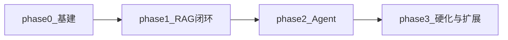

# 开发计划：Agent + RAG 智能助手（游戏社区玩家客服）

## 目标与原则

1. **产品对齐**：玩家通过 **[frontend/](./frontend/)** 与智能客服对话；知识库内容围绕**游戏社交平台**业务（抢购、发帖、社交、充值、举报等）。文案与快捷问题与前端保持一致，后端回答风格与引用需适配客服场景。
2. **先打通 RAG 垂直闭环**，再叠加 Agent 多步推理与工具，避免在未稳定检索链时堆叠复杂度。
3. **配置驱动双 LLM**：云端 OpenAI 兼容 API 与本地 Ollama（或同类）共用同一抽象，切换仅依赖配置。
4. **前后端契约优先**：HTTP 层实现 **`POST /api/chat`**（或与 `frontend` 环境变量约定一致的路径），与 `frontend/src/lib/chatApi.ts` 中的请求/响应字段对齐；开发环境配置 **CORS**。
5. **验收与 README 对齐**：每阶段结束有可演示产物与检查清单。

---

## 默认技术栈锁定（align-stack）

| 类别 | 默认选型 | 说明 |
|------|----------|------|
| **Python** | 3.11+ | 类型标注与异步生态成熟。 |
| **依赖管理** | `pyproject.toml`（推荐 uv 或 pip 安装） | 单一事实来源；可选锁文件由团队习惯决定。 |
| **配置** | `pydantic-settings` | 环境变量 + 可选 `.env`；与 Pydantic v2 模型校验一致。 |
| **编排 / Agent** | **LangGraph**（配合 LangChain 的消息、工具、Runnable 原语） | 图状态机表达 ReAct/工具循环清晰。 |
| **向量库（开发/MVP）** | **Chroma** | 本地持久化简单；注意 embedding 维度与集合元数据一致性。 |
| **向量库（演进）** | pgvector 等 | Phase 3 或 backlog，非 MVP 必达。 |
| **HTTP 层** | **FastAPI** | 服务玩家前端；与 CLI 共用 core 层。 |
| **前端（已落地）** | **Vite + React + TypeScript + React Router** | 目录 `frontend/`；可选 `VITE_API_BASE_URL` 指向后端根地址。 |

**未锁定、可替换的扩展点**：具体 Embedding/Chat 模型厂商、PDF 解析库、重排序模型、前端组件库（当前为原生 CSS）。

---

## 仓库与目录规划（建议稿）

```
AICODE/
├── README.md
├── plan.md
├── frontend/
├── pyproject.toml
├── src/
│   ├── settings.py
│   ├── aicode_types.py
│   ├── llm/
│   ├── embeddings/
│   ├── rag/
│   ├── addrag/             # 独立 ingest 程序（md-only）
│   └── assistant/          # 兼容入口壳：api/cli 与历史导入转发
├── tests/
├── data/
└── docs/
```

---

## 阶段划分



**说明**：`frontend/` 壳层与演示流程**已存在**；后端 Python 工程按 Phase 0 起逐步补齐。Phase 3 应完成与前端的**真实联调**（非仅 CLI）。

### Phase 0 — 基建

- 初始化 Python 项目：`pyproject.toml`、包结构、`src/` 同级模块布局（`settings/llm/embeddings/rag`）。
- 使用 `pydantic-settings` 加载配置（LLM provider、base_url、api_key 环境变量名、模型名、温度等）。
- 实现 **LLM 抽象层**：OpenAI 兼容客户端 + Ollama 适配路径，统一 `chat`（及后续 `stream` 占位接口）。
- 最小 CLI：例如 `assistant ask "你好"`，验证双后端切换。
- **（可选并行）** 最小 FastAPI 应用：`POST /api/chat` 先返回占位 JSON（`reply` 字段），供 `frontend` 联调与 CORS 验证。

**Phase 0 检查清单**

- [ ] 配置仅从环境/文件读取，仓库内无密钥。
- [ ] 切换 `LLM_PROVIDER`（或等价键）可分别走通云端与本地一次对话。
- [ ] `frontend` 在设置 `VITE_API_BASE_URL` 后能成功打到后端占位接口（无 404/CORS 阻断）。

### Phase 1 — RAG 闭环

- **Ingest**：TXT/Markdown 直读；PDF 基础解析；分块（大小/重叠可配置）；写入 **Chroma**（由独立 `python -m addrag ingest-md` 完成，后端仅查询）。
- **检索器**：Top-K、返回文本+元数据（文件名、块 id）。
- **对话**：将检索结果注入 system/user 模板；生成回答并 **附带引用列表**（与 README 验收一致）。
- **`/api/chat`**：将上述对话链路接到 HTTP，请求体为 `messages: { role, content }[]`，响应 `reply`（或前端兼容的 `message` 字段）。

**Phase 1 检查清单**

- [ ] 导入 fixture 文档后，针对文档内容提问，回答含可识别引用。
- [ ] Embedding 维度与 Chroma 集合一致，无静默截断/错维。
- [ ] 经 `frontend` 或 curl 完成一次带历史的问答闭环。

### Phase 2 — Agent

- 使用 **LangGraph** 构建带工具循环的图：内置工具（计算器、当前时间等）+ **检索作为 tool**，以及基于本地 **MySQL** 的业务工具：  
  - `get_user_orders`：按玩家账号/订单号从 MySQL 查询订单；  
  - `get_user_coupons`：从 MySQL 查询可用优惠券；  
  - `handoff_to_human`：生成当前会话 summary，并通过后端对接人工客服/工单系统（占位）。  
  所有工具调用都隐藏在后端 Agent 流程内部，前端始终只调用 `/api/chat`。
- 约束：最大步数、超时、工具失败重试/降级策略（文档化行为）。
- 与 Phase 1 的「自动注入 RAG」关系在代码与 README 运行说明中写清，避免两种入口混淆。

**Phase 2 检查清单**

- [ ] 演示至少一步工具调用或一步「检索后再答」链路（与 README 验收一致），其中至少一次为 MySQL 订单/优惠券查询工具。 
- [ ] 至少演示一次 `handoff_to_human` 调用，产生 summary 与工单/会话 ID 占位。
- [ ] 超限步数时安全停止并给用户可读提示。

### Phase 3 — 硬化与扩展

- **流式输出**（LLM `stream`；前端可后续改为 SSE/fetch stream）。
- **持久会话**（可选基于 MySQL 存储）：会话 id 与历史；与前端本地存储策略协调（可仍以客户端会话为主，服务端可选）。
- **Dockerfile**（前后端可分阶段或多服务编排占位）、基础测试与 CI（Python：`ruff`/`pytest`；前端：`eslint`/`npm run build`）。
- 更新 README：后端安装、环境变量、`uvicorn` 启动示例、与 `frontend` 联调步骤。

**Phase 3 检查清单**

- [ ] 流式路径可在 CLI 或 API 其一演示。
- [ ] CI 对主分支跑通约定检查（门槛可逐步提高）。
- [ ] 文档中记录生产部署时 CORS 允许源与 HTTPS 注意点。

---

## 里程碑与交付物

| 阶段 | 交付物 |
|------|--------|
| **前端壳层（已完成）** | `frontend/`：登录、聊天、快捷问题、`chatApi` 契约、演示回复 |
| Phase 0 | 可配置双 LLM + 最小 `ask` CLI +（推荐）占位 `/api/chat` + CORS |
| Phase 1 | Ingest + Chroma 检索 + 带引用问答 + 前端可联调真实 RAG 回复 |
| Phase 2 | LangGraph Agent + 工具与检索 tool + 步数/错误策略 |
| Phase 3 | 流式、可选服务端会话、Docker、CI、README 全链路运行说明 |

---

## 依赖与风险

| 风险 | 缓解 |
|------|------|
| PDF 解析质量差、版面乱 | MVP 接受纯文本优先；客服素材可优先 Markdown/HTML 导出。 |
| Embedding 维度与向量库/集合不一致 | 启动时校验维度；集合按模型名或维度版本命名。 |
| 本地模型上下文长度不足 | 控制分块总 token、检索 Top-K 与历史截断；配置化上限。 |
| 云端 API 速率限制与成本 | 重试+退避占位；日志中 Token 用量字段预留（README P1）。 |
| LangGraph/LangChain 版本升级 API 变更 | 锁定主版本范围于 `pyproject.toml`；核心逻辑收敛在自有抽象后。 |
| **前后端联调：CORS、路径、字段不一致** | 以 `chatApi.ts` 为单一契约；FastAPI 显式 `CORSMiddleware`；联调写进 Phase 0 检查项。 |
| **演示登录非真鉴权** | 正式环境对接平台 OAuth/会话 Cookie；README 已标注风险。 |

---

## 测试策略

- **单元测试**：分块边界、空文档、特殊字符；检索排序与 Top-K；prompt/消息列表拼装（固定模板快照或结构化断言）。
- **集成测试**：小 fixture 文档端到端 ingest → query → 断言引用字段存在；**mock LLM** 测 Agent 路由与工具选择。
- **API 契约测试**：对 `/api/chat` 使用固定 `messages` 请求体验证 JSON 结构与 200 响应（可 mock 下游 LLM）。
- **前端**：`npm run build`、关键路由与空会话快捷问题的手动或 E2E（可选 Playwright，不强制 MVP）。
- **不默认对真实 API 跑 CI**：密钥与费用；可选 nightly 或本地标记用例。

---

## 后续 backlog（不纳入 MVP）

- 重排序（cross-encoder / 专用 rerank API）。
- 多集合/多知识库路由（如「活动规则」「支付政策」分库）。
- **运营侧** Web 管理后台、数据看板；**原生** App。
- 玩家侧富交互：流式打字效果、工单转人工、满意度评价。
- pgvector 生产部署与迁移工具。
- 全量 OpenTelemetry 对接。

---

## 与 README 的对应关系

- 产品定位、玩家前端能力、接口约定、验收标准：**README.md** 为需求真源。
- 阶段任务、目录、默认技术栈、测试与风险：**本 plan.md** 为执行真源。
- 验收时以 README「验收标准」+ 本文件各 Phase **检查清单** 同时满足为准。
