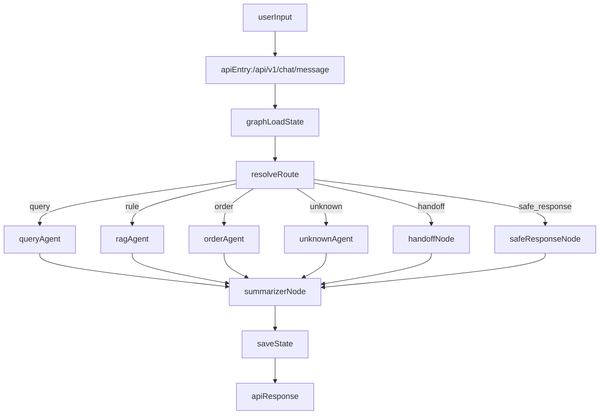

# 多 Agent 客服系统全链路流转说明

本文档描述当前系统从“用户发起问句”到“返回最终答案”的完整流转，包含分路由处理、状态变更与异常场景分析。

---

## 1. 总体流程

---

## 2. 入口与状态装载

入口接口：
- `POST /api/v1/chat/message`

输入：
- `user_id`
- `text`
- `session_id`（可选）

处理：
1. 编排器确保 `session_id` 存在（无则创建）。
2. 从会话存储装载 `GraphState.session`（`conversation`），并初始化本轮：
   - `runtime`（文本、子任务、路由、结果，含 `raw/result`）
   - `trace`（`rag_trace/sql_query_trace/order_trace/observability`）
3. 进入图执行。

任务模型说明：
- `runtime.sub_tasks` 使用多态任务联合 `Task`。
- 订单专属信息（如 `order_operation_hint`）仅存在于 `OrderTask`。

输出：
- 标准应答字段（`route/status/reply/...`）
- 观测字段（`request_id/workflow_step/handoff_status/debug_trace`）

---

## 3. 路由决策（resolveRoute）

### 3.1 路由来源

优先通过 `IntentRouterAgent`（LLM）分类：
- `query`
- `rule`
- `order`
- `unknown`

如果模型不可用，进入最小兜底规则。

### 3.2 活跃订单会话影响

若当前 `session_id` 下有活跃订单上下文（未 `closed/failed`）：
- 当前意图是 `query` 或 `rule`：允许跳出订单链路
- 否则：继续进入 `order`

### 3.3 人工接管影响

当 `handoff.enabled=true` 且配置 `HANDOFF_ENABLED=true`：
- 强制进入 `handoff` 分支

---

## 4. 分路由处理

## 4.1 Query 路由（SearchAgent）

目标：
- 处理“查询类”问题（例如：我的订单、订单状态、个人信息等）

执行步骤：
1. 使用 `create_sql_query_chain` 生成 SQL（模型驱动）。
2. 若 SQL 生成失败，使用本地 fallback SQL 模板。
3. 调用 SQL 执行工具：
   - 仅允许 `SELECT`
   - 仅允许白名单表（`sql_catalog.py`）
   - 禁止 `JOIN`、多语句
   - 强制追加当前 `user_id` 过滤条件（防越权）
4. 将查询结果交给总结逻辑生成回复。

常见状态：
- `ok`：查询成功
- `no_result`：无数据
- `error`：执行失败（SQL 非法、DB 错误等）

---

## 4.2 Rule 路由（RAGAgent）

目标：
- 处理规则、政策、条款解释

执行步骤：
1. 对向量库（Chroma）检索
2. 取回片段并做回答
3. 写入 `rag_trace`（query、命中片段、引用）

常见状态：
- `ok`：检索并回答成功
- `no_result`：未命中规则
- `error`：检索异常

---

## 4.3 Order 路由（OrderAgent）

目标：
- 处理下单/退单/改单等强控制动作

执行步骤（基于 chain）：
1. 识别订单操作类型
2. 收集必填字段
3. 进入执行前确认（`awaiting_pre_confirm`）
4. 执行订单动作（mock 工具）
5. 返回订单链接，等待点击确认（`executed_waiting_click`）
6. 点击确认后结束（`closed`）

常见状态：
- `collecting_info`
- `awaiting_pre_confirm`
- `executed_waiting_click`
- `closed`
- `failed`

---

## 4.4 Unknown 路由

目标：
- 意图不明时触发澄清

返回：
- `status=clarify`
- 引导用户说明是“查询/规则/订单动作”

---

## 4.5 Handoff 路由

目标：
- 人工接管开启时返回接管提示

返回：
- `status=handoff`
- `handoff_status=active`

---

## 4.6 SafeResponse 路由

目标：
- 图内异常或保护分支触发时，给出安全降级回答

返回：
- `status=safe_response`
- 统一兜底提示语

---

## 5. Summarizer 与响应封装

Summarizer 负责：
1. 统一文案风格
2. 状态控制“处理完成”前缀：
   - 仅 `status in {ok, closed}` 时添加“处理完成”
   - 其他状态不加
3. 注入观测信息：
   - `request_id`
   - `workflow_step`
   - `handoff_status`
   - `debug_trace`（受配置开关控制）

---

## 6. 状态持久化（当前：内存）

当前状态存储策略：
- 内存态 `SessionStore`
- 每轮对话末尾写回 `GraphState`
- 记录 user/assistant 历史 turn

限制：
- 服务重启后会话状态丢失

---

## 7. 异常场景分析

## 7.1 意图识别异常

场景：
- LLM 调用失败
- LLM 返回非预期格式
- 置信度低于阈值

表现：
- 可能回退到兜底规则，或返回 `unknown/clarify`

建议：
- 保留 `INTENT_CONFIDENCE_THRESHOLD`
- 对低置信度统一澄清，避免误路由

---

## 7.2 SQL 生成失败

场景：
- 云端模型 403（额度不足）
- chain 初始化不可用
- 生成非合法 SQL

表现：
- 进入 fallback SQL 模板
- 或执行层返回 `error`

建议：
- 当前已支持 fallback
- 增加“降级标记”便于定位是否走 fallback

---

## 7.3 SQL 执行异常

场景：
- DB 不可达
- 表结构与 catalog 不一致
- 违反执行限制（JOIN、多语句、非白名单表）

表现：
- `status=error`
- 错误信息包含具体失败原因

建议：
- 保持执行层强校验，不信任模型输出
- 增加审计日志（原 SQL、改写 SQL、request_id）

---

## 7.4 越权查询风险

场景：
- 用户尝试通过自然语言查询他人订单

防护：
- 执行层强制追加 `user_id = 当前用户`
- 非 owner 表仅允许公共信息查询

结论：
- 即使模型生成有偏，执行层仍应阻断越权

---

## 7.5 订单流程中断

场景：
- 用户在订单流程中突然发查询类问题

当前策略：
- 允许 `query/rule` 跳出活跃订单锁
- 保留订单上下文，用户可继续订单流程

风险：
- `workflow_step` 可能在 query 响应中显示订单默认步骤

建议：
- 前端按 `route` + `status` 联合解释，不仅看 `workflow_step`

---

## 7.6 端口与进程冲突

场景：
- Windows 下端口被历史进程占用（10048）

影响：
- 新代码未真正生效，出现“修了但仍报错”

建议：
- 固定一组联调端口并维护启动脚本
- 每次改动后确认实际服务 PID 与端口

---

## 8. 建议的观测与排障最小集

- 每次响应打印：`request_id`, `route`, `status`
- SQL 路由打印：`generated_sql`, `scoped_sql`, `table_name`, `user_id`
- RAG 路由打印：`retrieval_query`, `hit_count`
- 订单路由打印：`operation`, `workflow_step`

这样可以快速定位是“路由错了”“模型错了”还是“工具执行错了”。
