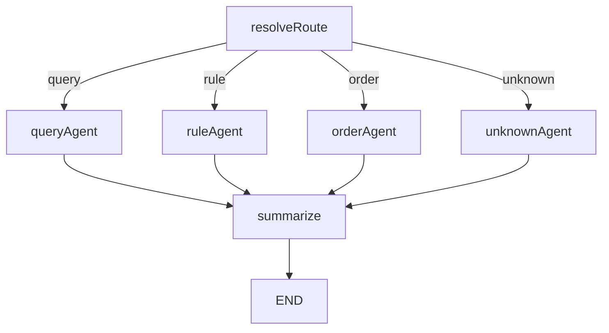

# 多 Agent 客服系统开发文档（含完成度）

## 1. 文档目的
说明当前代码实现状态，明确哪些功能已完成、哪些尚未完成，便于后续继续开发和联调。

## 2. 当前代码位置

### 2.1 后端
- 根目录：`D:\Agents\backend`
- 入口：`D:\Agents\backend\app\main.py`

### 2.2 前端副本
- 路径：`D:\Agents\frontend-copy`
- 已改为对接后端 `/api/v1` 协议（不改原前端）

## 3. 架构说明
当前采用：
- `IntentRouterAgent`：意图识别（LLM 结构化输出 + 置信度阈值）
- `SearchAgent`：查询类
- `RAGAgent`：规则类
- `OrderAgent`：订单类（LangChain chain 强控制）
- `SummarizerAgent`：最终回复整合
- `MultiAgentOrchestrator`：基于 LangGraph 的图编排

编排图（当前实现）：


## 4. 已完成功能（Done）

### 4.1 基础后端框架
- [x] FastAPI 工程初始化
- [x] `/api/v1` 路由注册
- [x] 健康检查接口

关键文件：
- `backend/app/main.py`
- `backend/app/api/v1/router.py`
- `backend/app/api/v1/health.py`

### 4.2 多 Agent 编排
- [x] 已实现基于 LangGraph 的 `IntentRouter -> 子Agent -> Summarizer` 图编排
- [x] 活跃订单流程会优先进入订单链路继续处理

关键文件：
- `backend/app/core/orchestrator.py`
- `backend/app/deps.py`

### 4.3 LLM 模式切换（本地/云端）
- [x] 已实现统一 LLM Provider
- [x] 支持每个 Agent 独立配置本地/云端开关与模型参数
- [x] Intent/Search/RAG/Summarizer 已接入 LLM 调用（失败时回退）
- [x] Intent 已升级为结构化分类输出（`intent/confidence/reason`）与阈值控制

关键文件：
- `backend/app/core/llm_provider.py`
- `backend/app/core/settings.py`
- `backend/app/agents/intent_router.py`
- `backend/app/agents/search_agent.py`
- `backend/app/agents/rag_agent.py`
- `backend/app/agents/summarizer_agent.py`

配置项：
- `INTENT_AGENT_USE_LOCAL` / `INTENT_AGENT_*`
- `SEARCH_AGENT_USE_LOCAL` / `SEARCH_AGENT_*`
- `RAG_AGENT_USE_LOCAL` / `RAG_AGENT_*`
- `SUMMARIZER_AGENT_USE_LOCAL` / `SUMMARIZER_AGENT_*`
- `INTENT_CONFIDENCE_THRESHOLD`

### 4.4 Order 强管控（LangChain chain）
- [x] 已使用 `RunnableLambda` 组装 chain 步骤
- [x] 已实现核心状态流：
  - `collecting_info`
  - `awaiting_pre_confirm`
  - `executed_waiting_click`
  - `closed / failed`
- [x] 已实现执行前确认、执行后返回链接、点击确认收尾
- [x] 默认不调用支付 API / 不扣余额
- [x] 失败返回原因

关键文件：
- `backend/app/chains/order_chain.py`
- `backend/app/agents/order_agent.py`
- `backend/app/tools/order_tools.py`

### 4.5 Search / RAG 错误处理
- [x] Search 无结果错误处理
- [x] RAG 无结果错误处理
- [x] RAG 异常错误处理

关键文件：
- `backend/app/agents/search_agent.py`
- `backend/app/agents/rag_agent.py`
- `backend/app/tools/rag_tool.py`

### 4.6 API 协议
- [x] `GET /api/v1/health`
- [x] `POST /api/v1/chat/message`
- [x] `POST /api/v1/orders/confirm`
- [x] `POST /api/v1/orders/finalize`
- [x] 已移除 `POST /api/v1/orders/execute` 及对应 schema

关键文件：
- `backend/app/api/v1/chat.py`
- `backend/app/api/v1/orders.py`
- `backend/app/schemas/chat.py`
- `backend/app/schemas/orders.py`

### 4.7 前端副本改造
- [x] 已复制前端到 `D:\Agents\frontend-copy`
- [x] 已接入 `/api/v1` 新协议
- [x] 已加入订单链接确认完成流程（finalize）

关键文件：
- `frontend-copy/src/lib/chatApi.ts`
- `frontend-copy/src/pages/ChatPage.tsx`

## 5. 未完成 / 待完善功能（TODO）

### 5.1 工具层真实化
- [ ] Search 工具仍为 mock 数据，需要替换真实搜索服务
- [ ] 订单工具为 mock（下单/退单/改单），需要接真实订单系统

涉及文件：
- `backend/app/tools/search_tool.py`
- `backend/app/tools/order_tools.py`

### 5.2 RAG 生产化细节
- [ ] 当前默认取首个 collection，可按业务指定 collection 名称
- [ ] 需要补充更细粒度检索参数配置（top_k、阈值、重排）

涉及文件：
- `backend/app/tools/rag_tool.py`

### 5.3 安全与鉴权
- [ ] 暂未接入正式鉴权机制（JWT/Session）
- [ ] 暂未做接口权限控制与审计日志

### 5.4 持久化与可观测性
- [ ] 当前订单上下文为内存会话存储，重启会丢失
- [ ] 缺少标准化日志、trace、指标监控

涉及文件：
- `backend/app/core/session_store.py`

### 5.5 测试体系
- [ ] 尚未补充完整单元测试、集成测试、回归测试
- [ ] 目前以编译与基础 smoke test 为主

## 6. 依赖与环境

### 6.1 Python 环境
- `D:\software\anaconda\envs\aicode-py311`

### 6.2 主要依赖
- `fastapi`
- `uvicorn[standard]`
- `pydantic`
- `chromadb`
- `langchain`
- `langgraph`
- `langchain-openai`
- `langchain-ollama`

依赖文件：
- `backend/requirements.txt`

## 7. 运行方式（当前）

在 `D:\Agents\backend` 下：

```powershell
& "D:\software\anaconda\envs\aicode-py311\python.exe" -m pip install -r requirements.txt
& "D:\software\anaconda\envs\aicode-py311\python.exe" -m uvicorn app.main:app --host 0.0.0.0 --port 18001
```

前端副本在 `D:\Agents\frontend-copy` 启动，确保 `VITE_API_BASE_URL` 指向后端地址（当前为 `http://127.0.0.1:18001`）。

## 8. 风险与建议
- 首次 RAG 检索可能触发模型下载，建议预热并缓存。
- 生产前应尽快替换 mock 工具与内存会话存储。
- 建议优先补充订单链路自动化测试，保证强管控逻辑稳定。
